# Context-Aware Planning Workflow for folder-mcp

## 🔄 Two-Command Enhanced Workflow

This workflow uses two commands for streamlined development with embedded architectural enforcement:

1. **`/create-phase-plan`** - Creates phase overview
2. **`/create-task-plan`** - Creates comprehensive task plans with embedded execution guidance and mandatory DI patterns

```mermaid
graph TD
    A[folder-mcp-roadmap-1.1.md] -->|/create-phase-plan 6| B[Phase-6-plan.md]
    B -->|/create-task-plan 6 1| C[Phase-6-Task-1.md with Embedded DI Guidance]
    C -->|Follow Embedded Execution Guidance| D[Implementation with Mandatory DI Validation]
    D -->|Human Verification| E[✅ Task 1 Complete]
    E -->|/create-task-plan 6 2| F[Phase-6-Task-2.md with Embedded DI Guidance]
    F -->|Follow Embedded Execution Guidance| G[Implementation with Mandatory DI Validation]
    G -->|Human Verification| H[✅ Task 2 Complete]
    
    E --> I[Update Phase Plan Progress]
    H --> I
    I --> J[Linear Progress: 2/11 Tasks Complete]
```



## 📋 How It Works

### Step 1: Create Phase Plan
```bash
/create-phase-plan 6
```
This generates a **high-level overview** with:
- All tasks listed with complexity estimates
- Phase-wide context and goals
- Progress tracking for the entire phase
- Links to create individual task plans

### Step 2: Create Enhanced Task Plans (As Needed)
```bash
/create-task-plan 6 1  # For Configuration System Foundation
/create-task-plan 6 2  # For Basic Daemon Architecture
# etc...
```
Each generates a **comprehensive implementation plan** with:
- Specific implementation assignments with embedded DI patterns
- Mandatory architectural validation after every assignment
- Living document progress tracking requirements
- Exact code locations and DI structure requirements
- Built-in module boundary enforcement

## 📊 Measurable Linear Progress

Since all work is sequential, progress is clearly measurable:

- **Phase Progress**: X/Y tasks complete (e.g., 3/11 = 27%)
- **Task Progress**: X/Y assignments complete (e.g., 2/5 = 40%)
- **Time Tracking**: Actual vs estimated for each task
- **Clear Handoffs**: Each task completion enables the next

No parallel work means:
- Simple progress tracking
- Clear dependencies
- No coordination overhead
- Predictable timeline

## 📊 Example: Phase 6 Linear Workflow

### 1. Generate Phase Plan
```bash
/create-phase-plan 6
```
Creates: `Phase-6-Configuration-Foundation-plan.md` with:
- 11 tasks in sequential order
- Linear progress tracking (0/11)
- Clear task sequence
- Overall timeline estimate

### 2. Start First Task
```bash
/create-task-plan 6 1
```
Creates: `Phase-6-Task-1-Configuration-System.md` with:
- Sequential implementation assignments
- Must complete Assignment 1 before 2, etc.
- Progress shown as percentage complete
- ~8-10 implementation steps in order

### 3. Follow Embedded Execution Guidance
The task plan now contains **all execution guidance embedded within**:
- **Mandatory DI patterns** visible in every assignment
- **Validation checklists** after each assignment
- **Living document requirements** built into progress tracking
- **Module boundary enforcement** throughout implementation
- **Human verification checklist** at task completion

### 4. Human Verification
- Review AI summary
- Run verification commands
- Check architecture
- Sign off on completion

### 5. Move to Next Task
```bash
/create-task-plan 6 2  # Only after Task 1 is verified complete
```

**Linear Progress Visualization**:
```
Phase 6: [██░░░░░░░░░] 2/11 Tasks (18%)
Task 2:  [████░░░░░░] 2/5 Assignments (40%)
```

## 🔧 Command Locations

Place these files in your project:
```
folder-mcp/
├── .claude/
│   └── commands/
│       ├── create-phase-plan.md
│       └── create-task-plan.md  # Enhanced with embedded execution guidance
├── folder-mcp-roadmap-1.1.md
├── IMPLEMENTATION-METHODOLOGY.md
└── [Your implementation plans will be generated here]
```


## 💡 Usage Tips for Linear Workflow

1. **Complete Tasks Sequentially**: Never start Task N+1 until Task N is 100% complete
2. **Track Progress Linearly**: Update percentage complete after each assignment
3. **Create Task Plans One at a Time**: Generate task plan only when ready to start that task
4. **Follow Embedded Validation**: Each assignment includes mandatory DI validation checklists
5. **Commit at Milestones**: Clear git history showing linear progression

## 🚀 Getting Started

1. Create the `.claude/commands/` directory
2. Save both command files there
3. Run `/create-phase-plan 6` to start with Phase 6
4. Run `/create-task-plan 6 1` when ready to implement first task

The enhanced `/create-task-plan` command will automatically:
- Extract all relevant information from your roadmap
- Structure it into actionable plans with embedded DI patterns
- Include mandatory validation checklists after every assignment
- Provide comprehensive architectural enforcement throughout
- Build in living document requirements for progress tracking

## 🚨 Enhanced Quality Gates

Every task plan now includes **MANDATORY ARCHITECTURAL ENFORCEMENT**:

1. **DI Patterns Embedded Throughout**
   - Interface → Implementation → Registration pattern in every assignment
   - Constructor injection requirements with validation commands
   - Module boundary checks after each step
   - Zero direct instantiation enforcement

2. **Comprehensive Validation After Every Assignment**
   - TypeScript build validation (zero errors required)
   - DI pattern compliance checks
   - Module boundary verification
   - Integration test requirements

3. **Living Document Progress Tracking**
   - Built-in progress tracking templates
   - Discovery documentation requirements
   - Time tracking and completion status
   - Human verification checklists embedded

4. **Architectural Consistency Throughout Long Sessions**
   - DI patterns visible in every assignment (prevents architectural drift)
   - Validation steps prevent progression with violations
   - Module boundary enforcement prevents coupling

These requirements are now **embedded within each task plan** to ensure visibility and compliance during long implementation sessions.

Complete Folder Structure for folder-mcp
📁 Project Structure with Context Engineering
folder-mcp/
├── .claude/                           # Claude-specific files
│   └── commands/                      # Slash commands
│       ├── create-phase-plan.md       # Creates phase overview
│       └── create-task-plan.md        # Creates comprehensive task plans with embedded execution guidance
│
├── docs/                              # All documentation
│   ├── development-plan/              # Development planning
│   │   ├── methodology/               # Development methodologies
│   │   │   ├── IMPLEMENTATION-METHODOLOGY.md
│   │   │   ├── USEFUL-PROMPTS.md
│   │   │   └── context-aware-workflow.md
│   │   └── roadmap/                   # Project roadmap
│   │       ├── completed/             # Completed implementation docs
│   │       │   ├── 0.endpoints-cleanup.md
│   │       │   ├── 1.mcp-endpoint-redesign.md
│   │       │   ├── 2.robust-real-folder-oriented-tests-implementation.md
│   │       │   ├── 3.tui-design-and-implementation-plan.md
│   │       │   ├── 4.tui-components-development.md
│   │       │   └── 5.tui-eliminate-all-dev-errors.md
│   │       ├── currently-implementing/
│   │       │   └── 6.configuration-foundation-CLI-TUI-parity.md
│   │       └── folder-mcp-roadmap-1.1.md
│   │
│   └── (other docs folders as needed)
│
├── src/                               # Source code with DI structure
│   ├── domain/                        # Interfaces only
│   │   └── config/
│   │       └── IConfigurationManager.ts
│   │
│   ├── application/                   # Business logic
│   │   └── config/
│   │       └── ConfigurationManager.ts
│   │
│   ├── infrastructure/                # External dependencies
│   │   └── config/
│   │       └── YamlFileLoader.ts
│   │
│   └── di/                           # Dependency injection
│       └── container.ts              # All service registrations
│
└── tests/                            # Test files
    ├── unit/
    ├── integration/
    └── e2e/
🔄 Workflow with Folder Structure
1. **Roadmap Reference**
   - Main roadmap: `docs/development-plan/roadmap/folder-mcp-roadmap-1.1.md`
   - Currently implementing: `docs/development-plan/roadmap/currently-implementing/`
   - Completed tasks: `docs/development-plan/roadmap/completed/`

2. **Create Implementation Plans** (if using PRP approach)
   - Plans would be generated in a designated folder
   - Follow task plans in the roadmap structure

3. **After Completion**
   - Completed tasks are already organized in `docs/development-plan/roadmap/completed/`
   - Update current task status
   - Continue to next task

📝 Key Points

- Roadmap and completed tasks live in `docs/development-plan/roadmap/`
- Methodology docs are in `docs/development-plan/methodology/`
- Source code follows strict DI structure (domain → application → infrastructure)
- Slash commands live in `.claude/commands/`

This structure keeps everything organized with:
- Clear separation of planning vs implementation
- Completed work already tracked in roadmap structure
- Methodologies grouped together
- Natural task progression tracking
